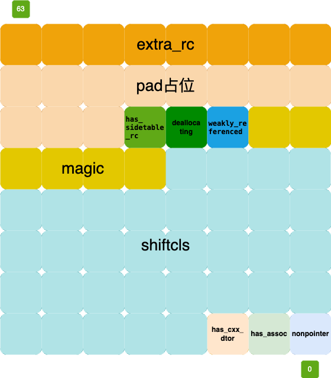
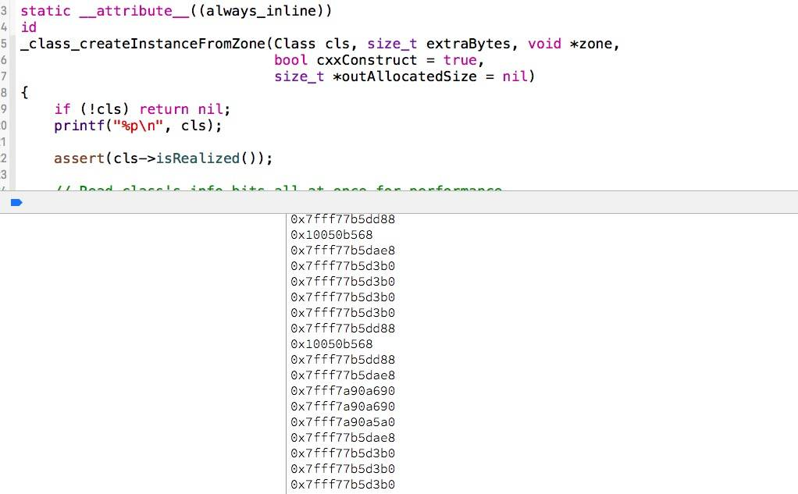
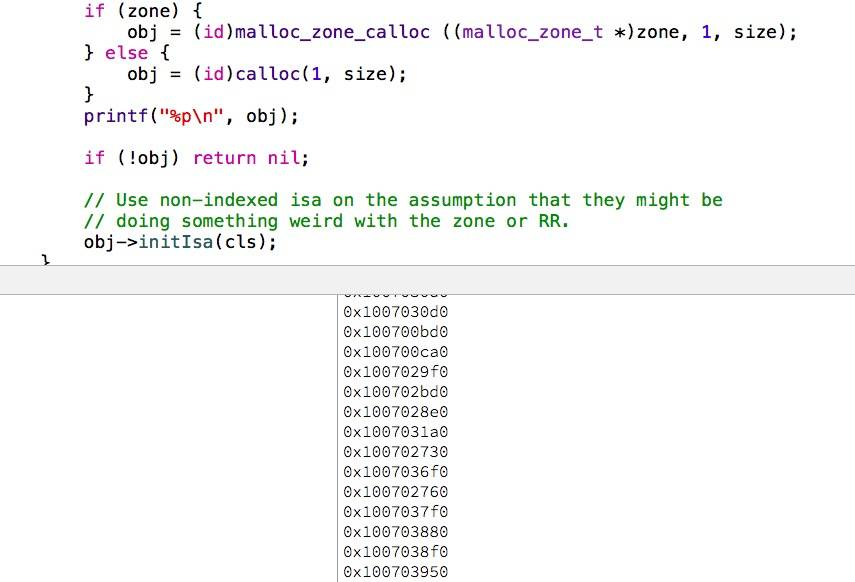
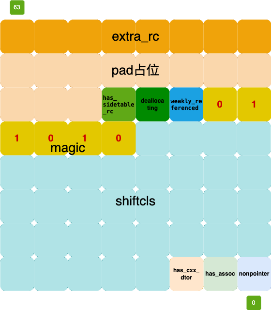
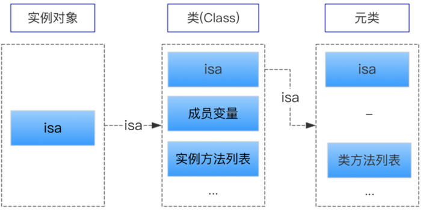
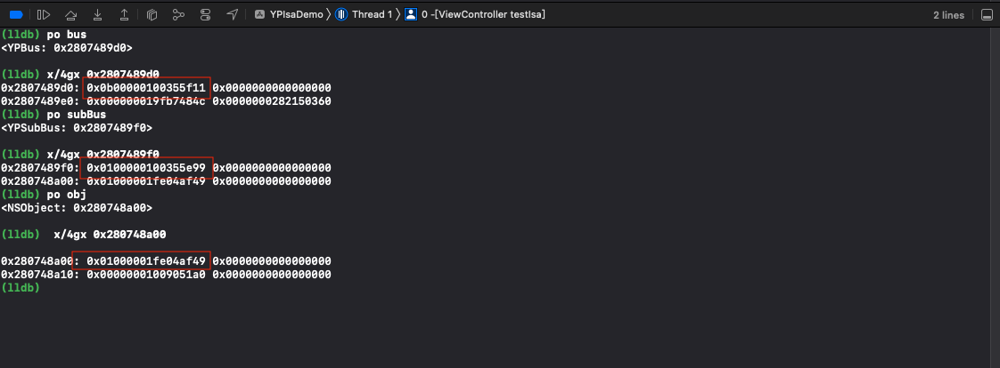
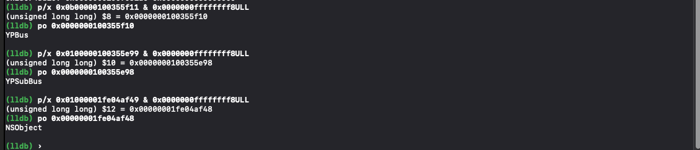
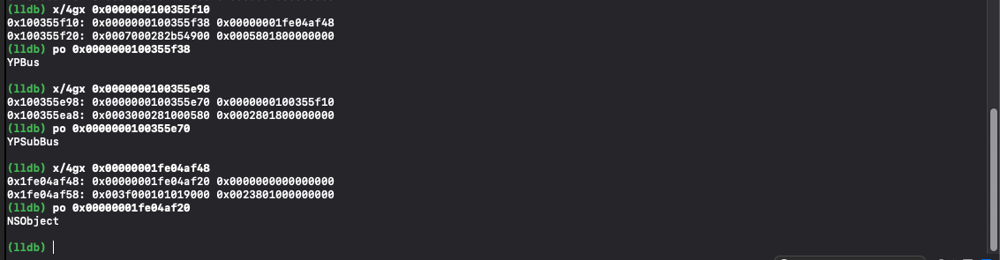
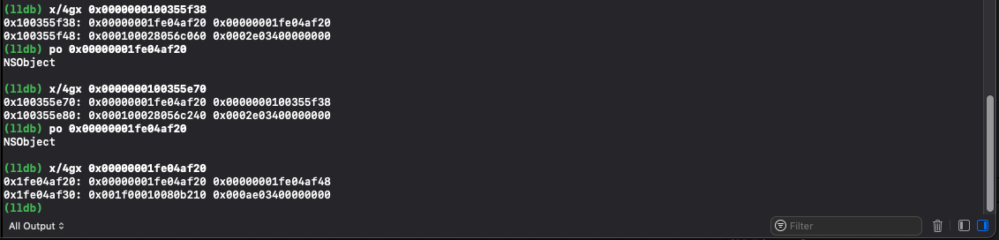

- [1. 联合体`union`](#1-联合体union)
  - [1.1 使用位运算 进行 存取 数据](#11-使用位运算-进行-存取-数据)
  - [1.2 位域简介](#12-位域简介)
    - [位域定义说明](#位域定义说明)
  - [1.3 结构体位域代码优化](#13-结构体位域代码优化)
  - [1.4 联合体优化代码](#14-联合体优化代码)
- [2. isa\_t 联合体](#2-isa_t-联合体)
  - [2.1 `isa_t`在哪？](#21-isa_t在哪)
  - [2.2 isa指针是什么？](#22-isa指针是什么)
  - [2.3 源码分析](#23-源码分析)
    - [`initIsa` 初始化](#initisa-初始化)
    - [`ISA()`获取类指针](#isa获取类指针)
  - [`rawISA()`获取元类指针](#rawisa获取元类指针)
  - [`getIsa()`获取类指针（支持`tagged pointer`）](#getisa获取类指针支持tagged-pointer)
  - [`isaBits()`获取`isa`的位值](#isabits获取isa的位值)
  - [2.4 代码测试](#24-代码测试)
- [3. 实例对象，类，元类的关系](#3-实例对象类元类的关系)
  - [3.1 代码测试](#31-代码测试)
  - [3.2 lldb查看](#32-lldb查看)
- [参考文档](#参考文档)

## 1. 联合体`union`

联合体`union`的定义方式与结构体一样，但是二者有根本区别。

什么是联合体(union)呢？联合体是一种特殊的类，也是一种构造类型的数据结构。完全就是共用一个内存首地址，并且各种变量名都可以同时使用，操作也是共同生效。所以也叫共用体。并且联合体(union)中是各变量是“互斥”的，但是内存使用更为精细灵活，也节省了内存空间。

在结构体中各成员有各自的内存空间，一个`结构变量`的`总长度是各成员长度之和`。而在“`联合`”中，`各成员共享一段内存空间`，`一个联合变量的长度等于各成员中最长的长度`。

### 1.1 使用位运算 进行 存取 数据

我们定义一个`YPCar`类 这个类 有`up` `down` `left` `right` 四个代表方向的`BOOL类型`的属性

```objective-c
@interface YPCar : NSObject

@property (nonatomic, assign) BOOL up;
@property (nonatomic, assign) BOOL down;
@property (nonatomic, assign) BOOL left;
@property (nonatomic, assign) BOOL right;
 
@end
```

```objective-c
YPCar *car = [[YPCar alloc] init];
unsigned long size = class_getInstanceSize(car.class);
NSLog(@"car对象所占用内存为：%lu", size);
```

进行打印

```
car对象所占用内存为：16
```

输出为`16`字节 其中包括 `isa` 和`4`个`BOOL`类型的属性 共 `8`+`1`+`1`+`1`+`1` = `12` 内存对齐 为 `16 字节`，我们知道 `BOOL`值 只有两种情况 `0` 或`1` , `一个字节`有`8`个二进制位 ，并且二进制 只有 `0` 或`1` 想到这里 那么我们完全可以使用一个二进制位来表示 一个`BOOL`值 。也就是这四个`BOOL`属性 我们可以用`4`个二进制位来表示如下图 ，大大节省了内存空间


按照我们的臆想来实现代码，首先分别声明 up down left right 掩码 mask ，来方便我们位运算取值赋值

```objective-c
#define LHDirectionUpMask    0b00001000
#define LHDirectionDownMask  0b00000100
#define LHDirectionLeftMask  0b00000010
#define LHDirectionRightMask 0b00000001
```

定义 char 类型 的成员变量

```objective-c
@interface YPCar : NSObject
{
    char _upDownLeftRight;
}
```

给`_upDownLeftRight`赋值

```objective-c
-(void)setUp:(BOOL)up
{
    if (up) {
        /// 如果需要将值置为1，将源码和掩码进行按位或运算
        _upDownLeftRight |= LHDirectionUpMask;
    }else{
        /// 如果需要将值置为0 // 将源码和按位取反后的掩码进行按位与运算
        _upDownLeftRight &= ~LHDirectionUpMask;
    }
}

-(void)setDown:(BOOL)down
{
    if (down) {
        _upDownLeftRight |= LHDirectionDownMask;
    }else{
        _upDownLeftRight &= ~ LHDirectionDownMask;
    }
}

- (void)setLeft:(BOOL)left
{
    if (left) {
        _upDownLeftRight |= LHDirectionLeftMask;
    } else {
        _upDownLeftRight &= ~LHDirectionLeftMask;
    }
}

- (void)setRight:(BOOL)right
{
    if (right) {
        _upDownLeftRight |= LHDirectionRightMask;
    } else {
        _upDownLeftRight &= ~LHDirectionRightMask;
    }
}
```

取值

```objective-c
-(BOOL)isUp
{
    return !!(_upDownLeftRight & LHDirectionUpMask);
}
-(BOOL)isDown
{
    return !!(_upDownLeftRight & LHDirectionDownMask);
}

-(BOOL)isLeft
{
    return !!(_upDownLeftRight & LHDirectionLeftMask);
 
}
-(BOOL)isRight
{
    return !!(_upDownLeftRight & LHDirectionRightMask);

}
```

按照图上示意 及我们的想法 这时候调用`getter`方法打印 初始化值

```objective-c
[car setDown:YES];
NSLog(@"isUp = %d, isDown = %d, isLeft = %d, isRight = %d", car.isUp, car.isDown, car.isLeft, car.isRight);

// isUp = 0, isDown = 1, isLeft = 0, isRight = 0
```

发现我们用一个字节的里的4个二进制位 就完成了 之前的 占有4个字节的 4个属性的读写

### 1.2 位域简介

有些信息在存储时，并不需要占用一个完整的字节，而只需占几个或一个二进制位。例如在存放一个开关量时，只有`0`和`1`两种状态，用`1位` `二进制位`即可。为了节省存储空间并使处理简便，C语言又提供了一种数据结构，称为"位域"或"位段"。所谓"位域"是把一个字节中的二进位划分为几个不同的区域，并说明每个区域的位数。每个域有一个域名，允许在程序中按域名进行操作。这样就可以把几个不同的对象用一个字节的二进制位域来表示。

```c
struct bs {
    int a:8;
    int b:2;
    int c:6;
}data;
```

说明 data 为 bs 变量，共占两个字节，其中位域a占8位，位域b占2位，位域 c 占6位。

#### 位域定义说明

1.  一个位域必须存储在同一个字节中，不能跨两个字节。如一个字节所剩空间不够存放另一位域时，应从下一单元起存放该位域
2.  由于位域不允许跨两个字节，因此位域的长度不能大于一个字节的长度，也就是说不能超过8位二进位。（如果最大长度大于计算机的整数字长，一些编译器可能会允许域的内存重叠，另外一些编译器可能会把大于一个域的部分存储在下一个字中。）
3.  位域可以是无名位域，这时它只用来作填充或调整位置。无名的位域是不能使用的

### 1.3 结构体位域代码优化

我们可以用结构体位域代码代替上述的位运算逻辑

```objective-c
struct {
        char up    : 1;
        char down  : 1;
        char left  : 1;
        char right : 1;
}_upDownLeftRight;

- (void)setUp:(BOOL)up {
        _upDownLeftRight.up = up;
}

- (void)setDown:(BOOL)down {
        _upDownLeftRight.down = down;
}

- (void)setLeft:(BOOL)left {
        _upDownLeftRight.left = left;
}

- (void)setRight:(BOOL)right {
        _upDownLeftRight.right = right;
}
 
- (BOOL)isUp {
        return !!_upDownLeftRight.up;
}

- (BOOL)isDown {
    return !!_upDownLeftRight.down;
}

- (BOOL)isLeft {
    return !!_upDownLeftRight.left;
}

- (BOOL)isRight {
    return !!_upDownLeftRight.right;
}
```

这样是可以正常存取，但是去掉了掩码`mask` 和初始化代码，导致可读性非常差。我们可以使用联合体优化一下代码：

### 1.4 联合体优化代码

```objective-c
#import "YPBus.h"

#define LHDirectionUpMask    0b00001000
#define LHDirectionDownMask  0b00000100
#define LHDirectionLeftMask  0b00000010
#define LHDirectionRightMask 0b00000001

@interface YPBus() {
    union{
        char bits;
        struct{
            char up   : 1;
            char down : 1;
            char left : 1;
            char right: 1;
        };
        
    }_upDownLeftRight;
 
}
@end

@implementation YPBus
- (instancetype)init
{
    self = [super init];
    if (self) {
        _upDownLeftRight.bits = 0b00000000;
    }
    return self;
}

-(void)setUp:(BOOL)up
{
    if (up) {
 
        _upDownLeftRight.bits |= LHDirectionUpMask;
    }else{
        _upDownLeftRight.bits &= ~LHDirectionUpMask;
    }
}

-(void)setDown:(BOOL)down
{
    if (down) {
        _upDownLeftRight.bits |= LHDirectionDownMask;
    }else{
        _upDownLeftRight.bits &= ~ LHDirectionDownMask;
    }
}

- (void)setLeft:(BOOL)left
{
    if (left) {
        _upDownLeftRight.bits |= LHDirectionLeftMask;
    } else {
        _upDownLeftRight.bits &= ~LHDirectionLeftMask;
    } 
}

- (void)setRight:(BOOL)right
{
    if (right) {
        _upDownLeftRight.bits |= LHDirectionRightMask;
    } else {
        _upDownLeftRight.bits &= ~LHDirectionRightMask;
    }
}
 
-(BOOL)isUp
{
    return !!(_upDownLeftRight.bits & LHDirectionUpMask);
    
}
-(BOOL)isDown
{
    return !!(_upDownLeftRight.bits & LHDirectionDownMask);
 }

-(BOOL)isLeft
{
     return !!(_upDownLeftRight.bits & LHDirectionLeftMask);
}
-(BOOL)isRight
{
    return !!(_upDownLeftRight.bits & LHDirectionRightMask);
}
```

其中 `_upDownLeftRight` 联合体只 占用了一个字节 因为结构体中
`up`、`down`、`left`、`right`、都只占用一位二进制空间，这就是 4 个二进制空间 而 `char` 类型 `bits` 也只占用了一个字节 他们都在联合体中 因此 共用一个字节的内存

总结： 通过掩码进行位运算来增加 效率 通过联合体结构 可以 节省内存空间

## 2. isa_t 联合体

`isa_t`是一个共用体，成员包括`cls`，`bits`，和一个结构体数据。公用一个内存，同时只会代表一个数据。

### 2.1 `isa_t`在哪？

我们可以通过`clang`把目标文件编译成`c++`文件

```
clang -rewrite-objc -fobjc-arc -fobjc-runtime=ios-13.0.0 -isysroot / Applications/Xcode.app/Contents/Developer/Platforms/ iPhoneSimulator.platform/Developer/SDKs/iPhoneSimulator13.0.sdk main.m
```

编译后的代码

```c++
struct YPBus_IMPL {
    struct NSObject_IMPL NSObject_IVARS;
    NSString *__strong name;
};
```

`NSObject_IMPL`又是什么？

```c++
struct NSObject_IMPL {
    __unsafe_unretained Class isa;
};
```

`Class`又是什么呢？查看源码

```c++
struct objc_class;
typedef struct objc_class *Class;
```

`Class`是一个`objc_class`类型的结构体，查看`objc_class`具体实现

```c++
// 代码简化
struct objc_class : objc_object {
    // Class ISA;
    Class superclass;
    cache_t cache;             // formerly cache pointer and vtable
    class_data_bits_t bits; 
}
struct objc_object {
    char isa_storage[sizeof(isa_t)];
}
```

经过简化后，`YPBus`类的结构如下:

```c++
struct NSObject_IMPL {
    char isa_storage[sizeof(isa_t)];
    Class superclass;
    cache_t cache;             // formerly cache pointer and vtable
    class_data_bits_t bits; 
};
```

其中`isa_storage`就是`isa`，类型为`isa_t`

###  2.2 isa指针是什么？

`isa`指针保存着指向类对象的内存地址，类对象全局只有一个，因此每个类创建出来的对象都会默认有一个`isa`属性，保存类对象的地址，也就是`class`，通过`class`就可以查询到这个对象的属性和方法，协议等；

在现代 64 位架构中，`isa` 指针被设计成一个压缩的位域结构，以便更多的编码信息可以直接存储在 `isa` 指针中，而不仅仅是一个指向类对象的指针。

我们通过源码查看

```c++
union isa_t {
    isa_t() { }
    isa_t(uintptr_t value) : bits(value) { }

    Class cls;
    uintptr_t bits;
#if defined(ISA_BITFIELD)
    struct {
        ISA_BITFIELD;  // defined in isa.h
    };
#endif
};
```

由上面的介绍联合体概念可以知道，cls和bits之间是互斥的，即有cls就没有bits,有bits就没有cls。

然后在看看ISA_BITFIELD是什么

```c++
# elif __arm64__
#     define ISA_MASK        0x0000000ffffffff8ULL
#     define ISA_MAGIC_MASK  0x000003f000000001ULL
#     define ISA_MAGIC_VALUE 0x000001a000000001ULL
#     define ISA_HAS_CXX_DTOR_BIT 1
#   define ISA_BITFIELD                                                        \
        uintptr_t nonpointer        : 1;                                       \
        uintptr_t has_assoc         : 1;                                       \
        uintptr_t has_cxx_dtor      : 1;                                       \
        uintptr_t shiftcls          : 33; /*MACH_VM_MAX_ADDRESS 0x1000000000*/ \
        uintptr_t magic             : 6;                                       \
        uintptr_t weakly_referenced : 1;                                       \
        uintptr_t unused            : 1;                                       \
        uintptr_t has_sidetable_rc  : 1;                                       \
        uintptr_t extra_rc          : 19
#     define RC_ONE   (1ULL<<45)
#     define RC_HALF  (1ULL<<18)
```

但是我们在实际场景中，`extra_rc`实际上并没有占`19`位。

在 ARM64 架构下，isa 的位域布局在真机和模拟器上确实有所不同。

在真机（ARM64）上，extra_rc 实际只占用 8 位，而不是定义中的 19 位。这是因为：

真机的内存布局：

```
非指针 isa (arm64):
+----+--------------+--------+-------------------+-----------+------------+------------+------------+---------+
| 位  | 0           | 1      | 2                | 3-35      | 36-41     | 42         | 43         | 44-63   |
+----+--------------+--------+-------------------+-----------+------------+------------+------------+---------+
|作用 | nonpointer  |has_assoc|has_cxx_dtor     | shiftcls  | magic     | weakly_ref |deallocating| extra_rc|
+----+--------------+--------+-------------------+-----------+------------+------------+------------+---------+
```

让我修改代码以反映真实的位域布局：

```c++
# elif __arm64__
#     define ISA_MASK        0x0000000ffffffff8ULL
#     define ISA_MAGIC_MASK  0x000003f000000001ULL
#     define ISA_MAGIC_VALUE 0x000001a000000001ULL
#     define ISA_HAS_CXX_DTOR_BIT 1
#   define ISA_BITFIELD                                                        \
        uintptr_t nonpointer        : 1;                                       \
        uintptr_t has_assoc         : 1;                                       \
        uintptr_t has_cxx_dtor      : 1;                                       \
        uintptr_t shiftcls          : 33; /*MACH_VM_MAX_ADDRESS 0x1000000000*/ \
        uintptr_t magic             : 6;                                       \
        uintptr_t weakly_referenced : 1;                                       \
        uintptr_t unused            : 1;                                       \
        uintptr_t pad               : 11; // 填充位
        uintptr_t extra_rc          : 8;  // 真机上只有8位
#     define RC_ONE   (1ULL<<45)
#     define RC_HALF  (1ULL<<18)
```

对上述各个位域分析

| 参数名            | 作用                                                         | 大小 | 所在位置 |
| :---------------- | ------------------------------------------------------------ | ---- | -------- |
| nonpointer        | 是否对`isa`指针开启指针优化 0：纯`isa`指针只包含类对象地址 1：`isa`中包含了类对象地址、类信息、对象的引用计数等 | 1    | 0        |
| has_assoc         | 是否有关联对象 0：没有  1：存在                              | 1    | 1        |
| has_cxx_dtor      | 该对象是否有`C++`或者`Objc`的析构器  如果有析构函数则需要做析构逻辑 如果没有则可以更快的释放对象 | 1    | 2        |
| shiftcls          | 存储类指针的值。开启指针优化的情况下，在`arm64`架构中有 33 位用来存储类指针 | 33   | 3~35     |
| magic             | 用于调试器判断当前对象是真的对象还是没有初始化的空间         | 5    | 36~40    |
| weakly_referenced | 是否有弱引用 0：没有 1：存在                                 | 1    | 41       |
| deallocating      | 是否正在释放内存 0：不是 1：是                               | 1    | 42       |
| has_sidetable_rc  | 是否需要用到外挂引用计数，当对象引用技术大于 2^7， 则需要借用该变量存储进位 | 1    | 43       |
| pad               | 填充位                                                       | 11   | 44       |
| extra_rc          | 该对象的引用计数值，如果引用计数大于 2^7 则需要使用 `has_sidetable_rc` | 8    | 56~63    |

`__arm64__`架构`isa`位图如下：



### 2.3 源码分析

#### `initIsa` 初始化

```c++
inline void 
objc_object::initIsa(Class cls, bool nonpointer, UNUSED_WITHOUT_INDEXED_ISA_AND_DTOR_BIT bool hasCxxDtor)
{ 
    ASSERT(!isTaggedPointer()); 
    
    isa_t newisa(0);

    if (!nonpointer) {
        newisa.setClass(cls, this);
    } else {
        ASSERT(!DisableNonpointerIsa);
        ASSERT(!cls->instancesRequireRawIsa());

#if SUPPORT_INDEXED_ISA
        ASSERT(cls->classArrayIndex() > 0);
        newisa.bits = ISA_INDEX_MAGIC_VALUE;
        // isa.magic is part of ISA_MAGIC_VALUE
        // isa.nonpointer is part of ISA_MAGIC_VALUE
        newisa.has_cxx_dtor = hasCxxDtor;
        newisa.indexcls = (uintptr_t)cls->classArrayIndex();
#else
        newisa.bits = ISA_MAGIC_VALUE;
        // isa.magic is part of ISA_MAGIC_VALUE
        // isa.nonpointer is part of ISA_MAGIC_VALUE
#   if ISA_HAS_CXX_DTOR_BIT
        newisa.has_cxx_dtor = hasCxxDtor;
#   endif
        newisa.setClass(cls, this);
#endif
#if ISA_HAS_INLINE_RC
        newisa.extra_rc = 1;
#endif
    }
    isa() = newisa;
}

```

```c++
// setClass 函数简化后如下
inline void
isa_t::setClass(Class newCls, UNUSED_WITHOUT_PTRAUTH objc_object *obj)
{
    shiftcls = (uintptr_t)newCls >> 3;
}
```

* 当`nonpointer`为`0`，说明是纯`isa`指针，执行`setClass`操作，内部将`cls`的地址右偏移`3`位，然后赋值给`shiftcls`。

  **将当前地址右移三位的主要原因是用于将 Class 指针中无用的后三位清楚减小内存的消耗，因为类的指针要按照字节（8 bytes）对齐内存，其指针后三位都是没有意义的 0**。

  而 ObjC 中的类指针的地址后三位也为 0，在 `_class_createInstanceFromZone` 方法中打印了调用这个方法传入的类指针：

  

  可以看到，这里打印出来的**所有类指针十六进制地址的最后一位都为 8 或者 0**。也就是说，类指针的后三位都为 0，所以，我们在上面存储 `Class` 指针时右移三位是没有问题的。

  如果再尝试打印对象指针的话，会发现所有对象内存地址的**后四位**都是 `0`，说明 `ObjC` 在初始化内存时是以 `16` 个字节对齐的, 分配的内存地址后四位都是` 0`。

  

* 设置`nonpointer`和`magic`

  对整个 `isa` 的值 `bits` 进行设置，传入 `ISA_MAGIC_VALUE`：

  ```c++
  ISA_MAGIC_VALUE 0x000001a000000001ULL
  ```

  我们把它转化成二进制的数据，然后看一下哪些属性对应的位被这行代码初始化了（标记为红色）：

  

  从图中了解到，在使用 `ISA_MAGIC_VALUE` 设置 `isa_t` 结构体之后，实际上只是设置了 `nonpointer` 以及 `magic` 这两部分的值。

* 设置``has_cxx_dtor``

  在设置 `indexed` 和 `magic` 值之后，会设置 `isa` 的 `has_cxx_dtor`，这一位表示当前对象有 C++ 或者 ObjC 的析构器(destructor)，如果没有析构器就会快速释放内存。

  ```c++
  isa.has_cxx_dtor = hasCxxDtor;
  ```

* 设置`shiftcls`

  在为 `indexed`、 `magic` 和 `has_cxx_dtor` 设置之后，我们就要将当前对象对应的类指针存入 `isa` 结构体中了。

  ```c++
  newisa.setClass(cls, this);
  ```

  与上述`nonpointer`为`0`时逻辑一样。

* 设置`extra_rc`

  ```c++
  newisa.extra_rc = 1;
  ```

  初始化时默认引用计数为`1`

* 赋值`isa`

  在`    objc_object`结构体中设置了`isa`访问器，通过调用`isa() = newisa`来给实例对象设置`isa`指针

#### `ISA()`获取类指针

```c++
// 源码简化如下
inline Class
objc_object::ISA(bool authenticated) {
    ASSERT(!isTaggedPointer());
    // 不是taggedPointer对象 
    uintptr_t clsbits = bits;
    clsbits &= ISA_MASK;
    return (Class)clsbits;
}
```

通过`isa`指针与`isa`掩码进行按位与操作，得到类对象的指针

### `rawISA()`获取元类指针

```c++
inline Class
objc_object::rawISA()
{
    ASSERT(!isTaggedPointer() && !isa().nonpointer);
    return (Class)isa().bits;
}
```

元类指针只包含类地址，只获取`bits`即可。

### `getIsa()`获取类指针（支持`tagged pointer`）

```c++
inline Class
objc_object::getIsa() 
{
    if (fastpath(!isTaggedPointer())) return ISA(/*authenticated*/true);

    extern objc_class OBJC_CLASS_$___NSUnrecognizedTaggedPointer;
    uintptr_t slot, ptr = (uintptr_t)this;
    Class cls;

    slot = (ptr >> _OBJC_TAG_SLOT_SHIFT) & _OBJC_TAG_SLOT_MASK;
    cls = objc_tag_classes[slot];
    if (slowpath(cls == (Class)&OBJC_CLASS_$___NSUnrecognizedTaggedPointer)) {
        slot = (ptr >> _OBJC_TAG_EXT_SLOT_SHIFT) & _OBJC_TAG_EXT_SLOT_MASK;
        cls = objc_tag_ext_classes[slot];
    }
    return cls;
}
```

* 如果对象不属于`tagged Pointer`，则调用`ISA（）`返回`isa`；
* 如果属于`tagged Pointer`，则找到`slot`标记位，然后获取`cls`

### `isaBits()`获取`isa`的位值

```c++
inline uintptr_t
objc_object::isaBits() const
{
    return isa().bits;
}
```

### 2.4 代码测试

首先获取对象的`isa`值

```objective-c
YPCar *car = [[YPCar alloc] init];
for (int i = 0; i < 10; i++) {
        [bus retain];
}
uintptr_t isa = *(uintptr_t *)(__bridge void *)car;
```

打印`isa`的内存分布

```c++
0000 1011 0000 0000 0000 0000 0000 0001 0000 0010 0110 1000 0001 1111 0001 0001
```

* 最低位为`1`，说明是优化后的`isa`

* 查看最高`8`位 `0000 1011`，值为`11`，说明对象`car`的引用计数为`11`

* 查看`shiftcls`位

  ```
  0001 0000 0010 0110 1000 0001 1111 0001 0
  ```

  `shiftcls >> 3` ，转成`16`进制，结果为**`0x102681f10`**，获取对象`car`的`Class`地址

  ```c++
  Class cls = object_getClass(car);
  // 0x102681f10
  ```

  结果一致，说明`isa`指针的`shiftcls`位存储着`Class`地址

给对象`bus`设置关联对象

```objective-c
objc_setAssociatedObject(bus, @"12", @"11111", OBJC_ASSOCIATION_RETAIN_NONATOMIC);
```

打印`isa`的内存分布

```
0000 1011 0000 0000 0000 0000 0000 0001 0000 0010 0110 1000 0001 1111 0001 0011
```

发现第二位已经变成了`1`

## 3. 实例对象，类，元类的关系

元类(Meta class) 就是**类对象**的**类**，**每个类都有自己的元类**，也就是`objc_class`结构体里面的`isa`指针所指向的类。元类用来表述类对象本身所具备的元数据， **因为元类中存储着类对象的方法列表，即类方法**。

下面将介绍实例对象、类、元类之间的关系，如下图所示：



当向对象发消息时，`runtime`会在这个**对象所属类**的实例方法列表中查找消息对应的方法实现(`IMP`)。但当向类发送消息时，`runtime`就会在这个类的**元类**(`meta class`)方法列表里查找。所有的元类(`meta class`)，包括根类(`Root class`)，父类(`Superclass`)，子类(`Subclass`)的`isa`最终都指向根类(`Root class`)的元类(`meta class`)，这样能够形成一个闭环。可以总结为：

- 当发送消息给实例对象时，runtime函数会在**此实例对象所属类的实例方法列表**中查找方法实现(IMP)并调用，此为**实例方法调用**。

- 当发送消息给类对象时，runtime函数会在**此实例对象所属类的元类的方法列表**中查找方法实例(IMP)并调用，此为**类方法调用**。

我们可以通过代码和`LLDB`分别测试上述之间的关系

### 3.1 代码测试

```objective-c
// 打印对象的基本结构
+ (void)printObjectStructure:(id)obj {
    printf("------------------对象的基本结构--------------\n");
    printf("对象地址: %p\n", obj);
    printf("对象大小: %zu bytes\n", malloc_size((__bridge const void *)obj));
    // isa的地址实际上是实例对象的地址
    printf("isa 地址: %p\n", (__bridge void *)obj);
    printf("isa 值: 0x016%lx\n", [self printObjectISA:obj]);
    
    uintptr_t isa = [self printObjectISA:obj];
    Class cls1 = (Class)(isa & ISA_MASK);
    Class cls2 = object_getClass(obj);
    printf("类对象地址: 0x016%lx, 实例对象isa指向的地址为：0x016%lx\n", (uintptr_t)cls1, (uintptr_t)cls2);
    
    uintptr_t cls_isa = *(uintptr_t *)(__bridge void *)cls1;
    Class metaCls1 = (Class)(cls_isa & ISA_MASK);
    Class metaCls2 = object_getClass(cls2);
    printf("元类对象地址: 0x016%lx，类对象isa指向的地址为：0x016%lx\n", (uintptr_t)metaCls1, (uintptr_t)metaCls2);
    
    uintptr_t meta_isa = *(uintptr_t *)(__bridge void *)metaCls1;
    Class rootCls1 = (Class)(meta_isa & ISA_MASK);
    Class rootCls2 = object_getClass(metaCls2);
    printf("根元类对象地址: 0x016%lx，元类对象isa指向的地址为：0x016%lx\n", (uintptr_t)rootCls1, (uintptr_t)rootCls2);
    
    Class rootCls_self = object_getClass(rootCls1);
    printf("根元类对象isa指向的地址为: 0x016%lx\n", (uintptr_t)rootCls_self);
}
```

分别创建三个对象

```objective-c
YPBus *bus = [[YPBus alloc] init];
YPSubBus *subBus = [[YPSubBus alloc] init];
NSObject *obj = [[NSObject alloc] init];
```

对象`bus`打印数据：

```objective-c
对象地址: 0x2807489d0
对象大小: 16 bytes
isa 地址: 0x2807489d0
isa 值: 0x016b00000100355f11
类对象地址: 0x016100355f10, 实例对象isa指向的地址为：0x016100355f10
元类对象地址: 0x016100355f38，类对象isa指向的地址为：0x016100355f38
根元类对象地址: 0x0161fe04af20，元类对象isa指向的地址为：0x0161fe04af20
根元类对象isa指向的地址为: 0x0161fe04af20
```

对象`subBus`打印数据：

```objective-c
对象地址: 0x2807489f0
对象大小: 16 bytes
isa 地址: 0x2807489f0
isa 值: 0x016100000100355e99
类对象地址: 0x016100355e98, 实例对象isa指向的地址为：0x016100355e98
元类对象地址: 0x016100355e70，类对象isa指向的地址为：0x016100355e70
根元类对象地址: 0x0161fe04af20，元类对象isa指向的地址为：0x0161fe04af20
根元类对象isa指向的地址为: 0x0161fe04af20
```

对象`obj`打印数据：

```objective-c
对象地址: 0x280748a00
对象大小: 16 bytes
isa 地址: 0x280748a00
isa 值: 0x0161000001fe04af49
类对象地址: 0x0161fe04af48, 实例对象isa指向的地址为：0x0161fe04af48
元类对象地址: 0x0161fe04af20，类对象isa指向的地址为：0x0161fe04af20
根元类对象地址: 0x0161fe04af20，元类对象isa指向的地址为：0x0161fe04af20
根元类对象isa指向的地址为: 0x0161fe04af20
```

逻辑如下：

* 实例对象的`isa`指向类对象，类对象的`isa`指向元类地址，元类的`isa`指向根元类地址，根元类的`isa`指向自身。
* 子类的实例对象的`isa`指向子类对象，类对象的`isa`指向子元类地址，子元类的`isa`指向根元类地址，根元类的`isa`指向自身。
* 根类的实例对象(`instance Of Root class)`的`isa`指向根类(`Root class`)，根类的`isa`指针指向根元类(`Root meta class`)，根元类的`isa`指向它本身。
* 实例对象类的`superclass`指向根类，实例对象元类的`superclass`指向根元类。
* 子类的`superclass`指向父类，子元类的`superclass`指向父元类。
* 根类(`Root class`)的`superclass`指向`nil`，根元类的父类指向根类。

具体`isa`走向如下图：


### 3.2 lldb查看

如下代码，在控制台输出`bus`的数据结构，排在第一位的就是实例对象`isa`的地址。



对`isa`地址进一步分析，获取`isa`中的类地址以及对象



获取类对象`isa`的地址，以及`isa`指向的元类地址



获取元类对象`isa`的地址，以及`isa`指向的根元类地址



由此发现实例对象的元类`isa`指向根元类，根元类`isa`指向自身，与上述代码分析逻辑一致。

## 参考文档

[对象、类、元类、isa指针之间的爱恨情仇](https://wjerry.com/2018/05/%E5%AF%B9%E8%B1%A1-%E7%B1%BB-%E5%85%83%E7%B1%BB-isa%E6%8C%87%E9%92%88%E4%B9%8B%E9%97%B4%E7%9A%84%E7%88%B1%E6%81%A8%E6%83%85%E4%BB%87/)


